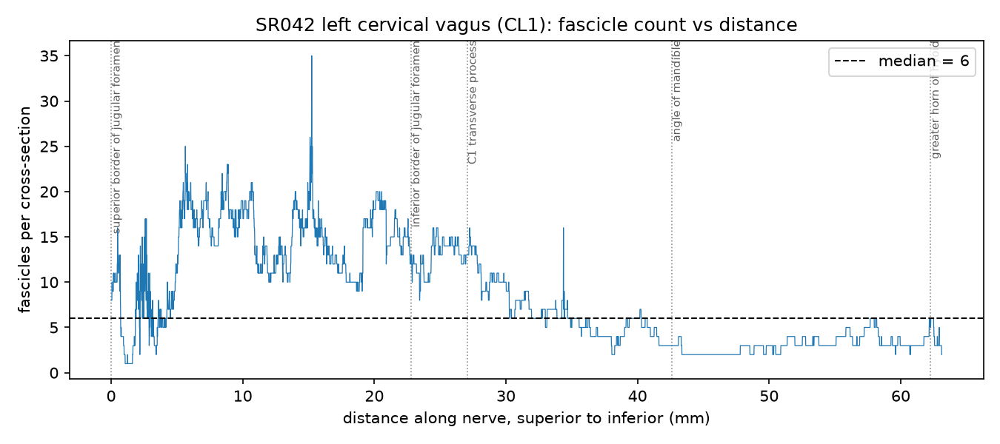

# Fascicle morphometry of one human cervical vagus nerve

An independent analysis of open microCT data from the REVA project. I measured how
many nerve bundles there are along one piece of human vagus nerve, how big they are,
how often they split and merge, and where each measurement sits relative to real
anatomical landmarks. I then compared my numbers to published values.

Nothing here is a new fact about the vagus nerve. What the project demonstrates is
working out an undocumented dataset from scratch, checking my own units and
assumptions before trusting them, comparing honestly against the literature, and
being explicit about a large gap in the source data that limits what anyone can
claim from it.

---

## 1. Where the data came from

**Project:** Reconstructing Human Vagal Anatomy (REVA), a collaboration between Case
Western Reserve University and Duke University, funded under the NIH SPARC program.
Case handles dissection and imaging; Duke handles computational analysis and
modelling.

**Portal:** [NIH SPARC](https://sparc.science/), hosted on Pennsieve.

**Dataset DOI:** [10.26275/rqkx-w7yx](https://doi.org/10.26275/rqkx-w7yx)

**Licence:** CC-BY-4.0, which permits reuse with attribution.

**Imaging:** microCT at 11.4 µm isotropic resolution. One pixel is 11.4 µm across,
so one square pixel is 129.96 µm².

I did not download or process the images. REVA's team segmented the fascicles and
tracked them between slices; the release publishes those measurements as tables, and
those tables are my starting point. The analysis code repositories for REVA were
listed as PENDING at the time I did this, so everything here is written from
scratch against the data standard document.

I do not redistribute the data. Download it from the DOI above and place the files
next to the scripts.

---

## 2. Exactly what data I looked at

The release contains subject **SR042**, and within it the **left cervical trunk**.
That file contains two segments:

| segment | slices | length | used? |
|---|---|---|---|
| **CL1** | 5,538 | 63.12 mm | **yes, this entire analysis** |
| CL2 | 7,744 | 151.40 mm | no |

**I analysed CL1 only.** Two reasons. The fascicle tracking graph is named
`SR042-CL1-...` and the landmark file is `SR042-CL1-vagal_levels.csv`, so both are
CL1-specific and the branching and landmark work cannot run on CL2 at all. CL2 also
uses a different slice numbering (starting at 91 rather than 2097) with no landmark
file to register it against.

CL2 is longer than CL1 and probably covers the mid-cervical region, which is where
the comparison paper measured. Leaving it unanalysed is a real limitation, not an
oversight, and it is the obvious next step.

**Left and right nerves use separate coordinate systems and must never be pooled.**
This is a left nerve throughout.

### The four files

| file | what one row is | rows |
|---|---|---|
| `SR042-left_cervical_trunk-FasMorph.csv` | one fascicle on one slice | 46,195 for CL1 |
| `SR042-left_cervical_trunk-NerveMorph.csv` | the nerve's outer boundary on one slice | 5,538 for CL1 |
| `SR042-CL1-vagal_levels.csv` | one anatomical landmark | 5 |
| `SR042-CL1-left_cervical_trunk-RawFascicleTracking.graphml` | the tracking graph | 47,274 nodes, 46,855 edges |

The GraphML file is the interesting one. It is a graph of dots and arrows. Each
**dot** is one fascicle on one slice. Each **arrow** says "this fascicle here is the
same fascicle as that one on the next slice down", and carries flags marking whether
that link is a split or a merge. The header says it was built with `igraph`.

### Where the nerve piece sits in the body

CL1 runs from the **superior border of the jugular foramen** (the hole in the skull
the vagus exits through) down to the **greater horn of the hyoid** in the throat.
That is roughly the upper neck. It is a small fraction of a whole vagus nerve, which
runs from the brainstem to the abdomen. Everything above the jugular foramen and
everything below the hyoid is absent from these files.

---

## 3. What I did with it

Five stages. Stages 1, 3 and 5 are checks; stages 2 and 4 are measurements. The
checks come first deliberately: if the units or the coordinate system are
misunderstood, every measurement is wrong in a way that still looks plausible.

```bash
python reva_analysis.py --stage 1     # inspect the files
python reva_analysis.py --stage 2     # count fascicles       -> fig1
python reva_analysis.py --stage 3     # check units, measure  -> fig2
python reva_analysis.py --stage 4     # count branching       -> fig3
python reva_analysis.py --stage 5     # register to anatomy
python make_animation.py              # flythrough video
```

### Stage 1 — inspect before trusting

Prints every column name, data type, and count of missing values, plus the GraphML
attribute schema. No arithmetic. This is where I found that the two files spell the
same quantity differently (`equivalent_diameter` versus `eq_diameter`), and where the
62% gap in the nerve file surfaced.

It also prints the spacing between consecutive `dist_global` values and the expected
value side by side. It comes out at 0.0114 mm, confirming that column is already in
millimetres rather than slice indices — a factor-of-87 trap avoided.

### Stage 2 — count the fascicles

Each row of the fascicle file is one fascicle on one slice, so grouping rows by slice
and counting group members gives the fascicle count at that depth. One line of pandas.

### Stage 3 — verify the size formula, then measure

A fascicle is an irregular blob. "Equivalent diameter" gives it one size number by
asking what width a circle of the same area would have: `2·√(area/π)`.

Before using that column I recomputed it from the area column for all 46,195 rows.
Largest disagreement: 5×10⁻¹³ pixels, which is floating-point noise. That confirms
both columns are in pixels and my conversion to millimetres is right. **The script
stops itself if this check ever fails**, because a units error would poison
everything downstream while still producing believable-looking output.

Then it converts to millimetres and reports sizes, flagging clearly which figures
come from the incomplete nerve file.

### Stage 4 — count the splits and merges

The graph already flags which arrows are splits and merges, so this is a counting
problem, and counting it correctly is the whole task.

**Count branch points, not arrows.** A fascicle splitting three ways produces three
flagged arrows but is one event. Collapsing arrows to the node they attach to turns
752 split arrows and 861 merge arrows into 323 splitting and 357 merging nodes.

**Splits use the arrow's source, merges use its target.** A split has one dot before
and several after, so the branch point is where the arrows start. A merge is the
mirror image.

47 nodes are flagged as both. Counting each once gives 633 events; counting them
twice gives 680. The script reports both.

One trap worth naming: GraphML declares these flags as `attr.type="boolean"` but
writes them as the text `"true"` and `"false"`. In Python `bool("false")` is `True`,
so testing the raw column would flag all 46,855 arrows as splits. Hence the
`truthy()` helper.

### Stage 5 — connect slices to anatomy

The landmark file measures position from the top of the whole scan (23.93 to
86.16 mm). The fascicle file restarts at 0 for each segment (0 to 63.12 mm). **The
release documents no way to relate the two**, which means you cannot say which slice
sits near which body part.

The bridge is the `index` column, which holds the global slice number and starts at
2097 rather than 0. So:

```
dist_global = (index − 2097) × 0.0114 mm
```

I tested this on all 5,538 slices. Worst disagreement: **7×10⁻¹⁵ mm**. The offset is
2097 × 0.0114 = **23.906 mm**. Stage 5 re-runs that check every time and refuses to
map the landmarks if the residual exceeds 1e-9 mm.

That single number is what makes every anatomical statement in this repo possible.

### The animation

`fascicle_plexus.mp4`, 37 seconds, one frame per 5 slices. Each fascicle is drawn as
its own measured ellipse at its own position, coloured by `track_id` so one fascicle
keeps one colour throughout. Branching fascicles are outlined in black; the dashed
outline is the nerve boundary, and frames where it could not be traced say so.

The static plots reduce each slice to a single number, discarding where the
fascicles sit. The video keeps that.

---

## 4. What I found

### Fascicle counts, and why the gradient is not a discovery

| where | fascicles per slice | median fascicle diameter |
|---|---|---|
| through the jugular foramen | 13.4 | 0.391 mm |
| jugular foramen → C1 | 12.9 | 0.398 mm |
| C1 → angle of the mandible | 6.5 | 0.430 mm |
| angle of the mandible → hyoid | 3.1 | 0.659 mm |

Count falls 4.3× from top to bottom. My first reading was that the nerve consolidates
into fewer, larger bundles.

**That reading is probably wrong at the proximal end.** The superior (jugular) and
inferior (nodose) ganglia sit in and just below the jugular foramen. A ganglion is a
mass of nerve cell bodies, not a set of parallel bundles, and every proximal signal
matches a ganglion rather than a trunk:

- 13.4 apparent fascicles against 3.1 distally
- nerve cross-sectional area 27.39 mm² against 2.6–3.2 mm² distally
- boundary tracing failing on 92–100% of slices there
- 218 branching events/cm against 18.8 distally

So the gradient is most likely "ganglion at the top, nerve at the bottom", which is
textbook anatomy. I am not claiming it as a finding.

The distal numbers are the ones worth trusting, and they check out. Published left
cervical vagus counts are 5.5 ± 1.4 fascicles; my C1-to-mandible band gives 6.5 and
mandible-to-hyoid gives 3.1. My overall median of 6 sits against Upadhye's 6.6 ± 2.8.



### The coordinate offset

Recovered and verified to 7×10⁻¹⁵ mm across all 5,538 slices. All five landmarks fall
inside the segment:

| landmark | whole-scan position | position in CL1 |
|---|---|---|
| superior border of jugular foramen | 23.93 mm | 0.03 mm |
| inferior border of jugular foramen | 46.71 mm | 22.80 mm |
| C1 transverse process | 51.00 mm | 27.10 mm |
| angle of the mandible | 66.50 mm | 42.60 mm |
| greater horn of hyoid | 86.16 mm | 62.25 mm |

Landing at 0.03 mm and 62.25 mm in a 63.12 mm segment means the dissection endpoints
were chosen anatomically, and confirms the offset independently.

### The missing data

**3,458 of 5,538 rows in the nerve file are blank** — 62%. The boundary could not be
traced, generally where the nerve abuts another structure. The gaps are not random:

| where | slices | blank |
|---|---|---|
| through the jugular foramen | 2000 | 92% |
| jugular foramen → C1 | 378 | **100%** |
| C1 → angle of the mandible | 1359 | 56% |
| angle of the mandible → hyoid | 1801 | 26% |

Every nerve-level statistic — outer diameter, nerve area, fascicular area fraction —
is therefore computed on a 37.6% sample weighted heavily to the distal half. The
release does not warn about this. My fascicle-level results are unaffected, because
the fascicle file has no missing rows.

---

## 5. How this compares to Upadhye et al. 2022

**The paper:** Upadhye et al., *Fascicles split or merge every ~560 microns within
the human cervical vagus nerve*, J. Neural Eng. 19(5), 2022,
[doi:10.1088/1741-2552/ac9643](https://doi.org/10.1088/1741-2552/ac9643).

**What they measured:** eight mid-cervical vagus nerves from five formaldehyde-fixed
cadavers. Scanned at 72 µm, reconstructed to 10 µm, then analysed as cross-sections
**every 100 µm**. Fascicles traced by hand. Their result: *"Over the middle 1 cm of
all eight nerves, there were 17.8 ± 6.1 merging and splitting events."* Dividing
10 mm by 17.8 gives the ~560 µm in the title.

**The denominator is centimetres of nerve.** Not distance travelled by individual
fascicles. I initially got this wrong — I divided by total fascicle path length,
reported 0.774 mm/event as a 1.4× match, and only caught it when I read the methods
rather than a summary of the abstract.

### The comparison

| | Upadhye 2022 | this analysis |
|---|---|---|
| nerves | 8, from 5 cadavers | 1, from 1 cadaver |
| location | mid-cervical | upper cervical, jugular foramen → hyoid |
| length measured | middle 1 cm of each | 6.3 cm continuous |
| voxel resolution | 10 µm | 11.4 µm |
| cross-sections analysed | every 100 µm | every 11.4 µm |
| fascicle tracing | manual | REVA's automated tracking |
| **fascicles per section** | **6.6 ± 2.8** | **6 median** ✓ |
| **events per cm** | **17.8 ± 6.1** | **100.3** ✗ |

Note their imaging was slightly *finer* than mine. The difference is sampling
interval, not image quality.

### What makes this analysis different

1. **Different tissue.** Theirs is mid-cervical, below where my segment ends. Mine is
   upper cervical and its proximal half is dominated by ganglion.
2. **Denser sampling.** Every slice rather than every ninth.
3. **Continuous coverage with landmarks.** They characterised a 1 cm window and
   reported one rate. I have 6.3 cm registered to anatomy, so I can show how the rate
   *changes* along the nerve. A 1 cm window structurally cannot show that.
4. **I did not do the tracing.** They hand-traced eight nerves — that is the
   scientific labour in their paper. I consumed REVA's automated output.

### Why the branching rates differ

Three reasons, in decreasing order of how well I can demonstrate them.

**Sampling density.** A fascicle that splits and rejoins within 100 µm is invisible
at their sampling and visible at mine. Binning my events into 100 µm windows imitates
their sampling and roughly halves my count.

**Anatomical position.** More fascicles in view means more chances for one to branch.
Combining both corrections:

| band | fascicles | events/cm at 11.4 µm | events/cm at 100 µm |
|---|---|---|---|
| through the jugular foramen | 13.4 | 218.2 | 76.4 |
| jugular foramen → C1 | 12.9 | 69.8 | 48.9 |
| C1 → angle of the mandible | 6.5 | 39.4 | 31.6 |
| angle of the mandible → hyoid | 3.1 | 18.8 | **15.8** |
| **Upadhye 2022** | 6.6 ± 2.8 | — | **17.8 ± 6.1** |

My most distal band at their sampling density gives **15.8 events/cm, inside their
error bar**. But the band matching their *fascicle count* still gives 31.6, above
their range. So this is a partial reconciliation, not a reproduction.

**Manual versus automated tracing — and this one I cannot test.** Their paper counts
a split only once the daughters have formed their own perineurium sheaths. That is a
judgement a person makes and an algorithm does not. A fascicle that pinches and
recovers across a few slices can register as a split followed by a merge. Across
5,538 slices there is a lot of room for that. Separating this from real biology would
need their tracking output alongside mine on the same nerve.

**The blank data may also contribute.** Where the nerve boundary could not be traced,
the fascicle segmentation in that region is working against the same difficult
imaging — the nerve pressed against neighbouring structures. The regions with the
worst blank rates are also the regions with the highest event rates (92–100% blank,
218 events/cm). I cannot rule out that some of that excess is segmentation
instability rather than anatomy.

**Honest conclusion:** 100.3 versus 17.8 is partly explained and partly not. I would
not present my rate as a correction to theirs.

---

## 6. Tools and libraries

Everything is Python 3.13. No paid or institutional software.

| tool | version used | what it does here |
|---|---|---|
| [pandas](https://pandas.pydata.org/) | 3.0.5 | all table handling: reading the CSVs, grouping rows by slice, unit conversion, missing-value accounting |
| [NumPy](https://numpy.org/) | — | array maths: the `2·√(area/π)` check, residuals, binning events by window |
| [Matplotlib](https://matplotlib.org/) | — | the three figures and the animation, via `FuncAnimation` and `FFMpegWriter` |
| [ffmpeg](https://ffmpeg.org/) | — | encodes the rendered frames into the MP4 |
| `xml.etree.ElementTree` | stdlib | parses the 45 MB GraphML tracking file |
| `argparse`, `glob`, `os`, `sys` | stdlib | command-line flags, filename matching, paths |

`networkx` is a reasonable alternative for the GraphML file and is worth knowing
about, but parsing the XML directly keeps the attribute names visible and avoids
loading 45 MB into a generic graph object when only two edge flags are needed.

The animation is drawn from geometry rather than rendered from voxels, because the
public derivative release provides segmented measurement tables and not the image
volume. Given the actual image stack, [napari](https://napari.org/) or
[3D Slicer](https://www.slicer.org/) would be the right tools instead.

```bash
pip install pandas numpy matplotlib
brew install ffmpeg          # or: apt install ffmpeg
```

---

## 7. Limitations

1. **One nerve, one subject, one side, one segment.** No statement here generalises
   to human anatomy. Upadhye had eight nerves from five cadavers and could report a
   standard deviation; I cannot.

2. **microCT under-resolves the smallest fascicles.** Zhang et al. 2025 report that
   segmentation "showed reduced performance in segmenting tiny fascicles" and that
   "the insufficient definition of these smallest fascicles appeared to confound both
   manual annotation and network prediction". So my median diameter of 0.423 mm is an
   overestimate — the small fascicles that would drag it down are under-represented —
   and my count of 6 per slice is a floor rather than an estimate.

3. **These are dissected, fixed, stained specimens, not living nerve.** Buyukcelik et
   al. 2023 note that segmentation is performed on tissue that "inevitably causes
   volume shrinkage", citing past estimates "on the order of 15–30%". Every absolute
   size in this repo carries that, and it is far larger than any of the differences I
   discuss elsewhere.

   I have not found a published figure quantifying how much microCT fascicle areas
   differ from matched histology on the same nerve. The papers I checked validate
   microCT against histology qualitatively rather than numerically, so I do not state
   a percentage.

4. **The nerve boundary is missing on 62% of slices, non-randomly.** Detailed above.

5. **CL2 is unanalysed.** 151 mm of the same nerve, more than twice CL1, and probably
   the region actually comparable to Upadhye's.

6. **I did not verify the segmentation or the tracking.** Both were done by REVA and
   consumed as given. Automated tracking is a candidate explanation for my elevated
   event rate, and I have no way to audit it from the released tables.

---

## 8. What I could not answer

**Is the distal fall in fascicle count real consolidation, or the resolution limit?**

Below C1 the total fascicle area barely changes (1.57 → 1.30 mm²) while median
diameter rises 53%. That fits fibres regrouping into fewer, larger bundles. It fits
equally well with small fascicles dropping below what an 11.4 µm scan resolves while
the large ones remain — removing the small members of a group raises its median
without moving the sum much.

Separating those needs histology on the same nerve at the same levels, where the
microCT-invisible fascicles are visible. REVA collects exactly that; it is not in the
public release. So the question is answerable, just not with these files.

---

## 9. Files in this repository

```
reva_analysis.py          five analysis stages, heavily commented
make_animation.py         builds the flythrough video
fig1_fascicle_count.png   fascicle count along the nerve, landmarks overlaid
fig2_diameters.png        fascicle size distribution and nerve caliber
fig3_events.png           where branching happens along the nerve
fascicle_plexus.mp4       37 s flythrough
```

Data files are not included. Download them from
[10.26275/rqkx-w7yx](https://doi.org/10.26275/rqkx-w7yx) and place them alongside the
scripts; both scripts locate their inputs by filename pattern.

## References

- Upadhye et al. (2022). Fascicles split or merge every ~560 microns within the human
  cervical vagus nerve. *J. Neural Eng.* 19(5).
  [doi:10.1088/1741-2552/ac9643](https://doi.org/10.1088/1741-2552/ac9643)
- Zhang, Lapierre-Landry, Kalpatthi, Jenkins, Wilson, Pelot & Shoffstall (2025).
  Automated 3D segmentation of human vagus nerve fascicles and epineurium from
  micro-computed tomography images using anatomy-aware neural networks.
  *J. Neural Eng.* [doi:10.1088/1741-2552/ae33f6](https://doi.org/10.1088/1741-2552/ae33f6)
  — source for the reduced segmentation performance on the smallest fascicles.
- Buyukcelik, Lapierre-Landry, Kolluru, Upadhye, Marshall, Pelot, Ludwig, Gustafson,
  Wilson, Jenkins & Shoffstall (2023). Deep-learning segmentation of fascicles from
  microCT of the human vagus nerve. *Front. Neurosci.* 17:1169187
  — source for the 15-30% tissue shrinkage estimate.
- REVA dataset, SPARC / Pennsieve.
  [doi:10.26275/rqkx-w7yx](https://doi.org/10.26275/rqkx-w7yx), CC-BY-4.0.
